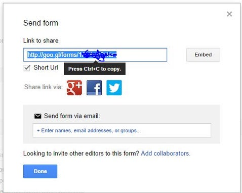

# Saving Temperature Sensor Data to Google Docs


This example uses a free helper service from pushingbox.com to store
temperature sensor data to a Google Sheets document.

## Step 1: Get Accounts (FREE)


1.  A regular Google account. Don\'t use your main Gmail account please)
2.  Get a user account on pushingbox.com. FREE!

## Step 2: Create a Google Form and Get FORM KEY

----------------------------------------------------------------------------
     
        
  --------------------------------------------- ----------------------------------------------------------------------------

Go to your new Google Drive and create a form. In this example I use a
single question TEXT responce form. Click *send form* when done.

There will be a pop-up shown with an option to copy a URL - click that
to copy this URL. Open this URL in another tab of your browser. This
will get you to the newly created form. Now,right-click and select
*Inspect Elements*. You will see the HTML code of the form. What you
need to find is a line of code that defines the Text input box,
something like *entry.123456789456123* (numbers will be different). This
is your **form key**, you will need to copy it.

## Step 3: Pushingbox, Service and Scenarios

 ----------------------------------------------------------------------------------------------
     
  ------------------------------------------------------- 

Log in to pushingbox.com using the same Google account. Go to *My
Services* and create a new custom service. Now please go to your Google
form and submit something. This loads a responce page of a form. Copy
it\'s URL and paste to pushingbox.com Service URL field. Give it some
good name and set method to GET.

Now go to my scenarios and paste into a scenario field:

``` {.sourceCode .none}
?entry.1917223082=$status$&submit=Submit
```

Change the numbers to your own FORM KEY. Copy the whole string and paste
it into the *add scenario field*. Click ADD. Pushingbox should confirm.
Click **ADD AN ACTION** and select the Service you created a moment ago.

This will give you a DEVICE ID remember this, in fact. write it down or
copy and paste it into a notepad doc. This will be used in the Mega ETH
code.

Congrats, you are done with that and now its time to work on the sketch
for the Mega ETH.

Step 4: Sketch for the Mega ETH

Here we post a very simple code to run this example. You will find a
section of things to be edited. This code will send responses to the
form you created in the form of data. You will see google then creates a
spreadsheet and logs all the responses WITH time stamps! Use this to
create data logs of temperature, light levels, humidity, motion whatever
you want! The example attached uses a DHT11 thermo/humidity sensor. You
can easily modify it for your actual purpose.

```c
    #include <SPI.h>
    #include <Ethernet3.h>
    #include <EthernetUdp.h>
    #include <SPI.h>
    #include <dht11.h> 

    #undef int
    #undef abs
    #undef double
    #undef float
    #undef round
    dht11 DHT11;
    #define DHT11PIN 3

    ///////////////////////////////
    ///      EDIT THIS STUFF     //
    ///////////////////////////////

    byte mac[] = {0xAA, 0xBB, 0xCC, 0xDD, 0xEE, 0xFF };  //Replace with your MAC
    byte ip[] = {192,168,0,50};     // Your Mega ETH device IP address

    char devid = v42FE15BC09B20df  // THIS IS THE DEVICE ID FROM PUSHINGBOX

    int del=300;  // Amount of seconds delay between posting to google docs.

    ///////////////////////////////
    //       DONE EDITING        //
    ///////////////////////////////

    char postmsg[100];
    int k=0;
    int temp_av = 0;
    char server[] = "api.pushingbox.com";
    EthernetClient client;

    void setup()
    {
      Serial.begin(9600);
      Ethernet.begin(mac, ip);
      delay(1000);
      Serial.println("connecting...");
    }

    void loop(){

    // average temp reading for 'del' time.........................................

      for(int j=0; j<del;j++)
      {
        // Read local temp........................................
        int chk = DHT11.read(DHT11PIN);
        int temp = Fahrenheit(DHT11.temperature);
        temp_av=temp_av+temp;
        delay(1000);
      }

      int avtemp=temp_av/(del);
      temp_av=0;


      // Post to Google Form.............................................
      if (client.connect(server, 80)) 
      {
        k=0;
        Serial.println("connected");
        sprintf(postmsg,"GET /pushingbox?devid=%c&status=%d HTTP/1.1",devid,avtemp);  // NOTE** In this line of code you can see where the temperature value is inserted into the wed address. It follows 'status=' Change that value to whatever you want to post.
        client.println(postmsg);
        client.println("Host: api.pushingbox.com");
        client.println("Connection: close");
        client.println();

        Serial.println(postmsg);
        Serial.println("Host: api.pushingbox.com");
        Serial.println("Connection: close");
        Serial.println();

        delay(1000);
        client.stop();
      }
      delay(1000);

      if (!client.connected()) 
      {
        Serial.println();
        Serial.println("disconnecting.");
        client.stop();
        k==1;
        return;
      }


    }


    double Fahrenheit(double celsius) // Function to convert to Fahrenheit
    {
        return 1.8 * celsius + 32;
    }
```
