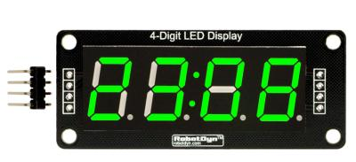

Often in our projects we need to display some information, and quite often, it is digital, like, time or temperature. In such a case, a TM1637-based LED is a very convenient choice.

In this example, we connect RobotDyn 4-Digit 7-Segment Tube to an MCU (RobotDyn Uno or Arduino Uno, etc.) and run some code to display various information. 6-digit, 8-digit variants of TM1637 LEDs work in a similar way.

This module comes either with a colon (for time display):



or decimal points after every digit:


## Connection

 

The LED module has 4 pins: 5v, Gnd, CLK and DIO. We connect 5v and Gnd to the corresponding pins of MCU, CLK and DIO to any free digitals pins.

## Software

It this example we will use this library: [tm1637.h](https://github.com/tehniq3/TM1637-display)

Other classic Arduino libraries, like TM1637.h, TM1637display.h by AVISHORPE and SevenSegmentTM1637.h should work as well.

<!--- When you download the library, you find several examples in the ```examples``` folder. Let's use some of them. --->


### Code

The example below displays **```1234```**, or any other 4 digits as they are preset in the sketch, and flashes the colon every 1 second:

```cpp

#include "TM1637.h"   // import the library
int8_t DispMSG[] = {1, 2, 3, 4};   // set the digits to be displayed

//Set up the pins where CLK and DIO are connected to
#define CLK 3
#define DIO 2

//Create a TM1637 class object
//and set the pin numbers
TM1637 tm1637(CLK, DIO);
void setup()
{
  tm1637.init();

  //Set up brightness
  /*
     BRIGHT_TYPICAL = 2 Medium
     BRIGHT_DARKEST = 0 Dark
     BRIGHTEST = 7      Bright
  */
  tm1637.set(BRIGHT_TYPICAL);
}
void loop()
{
  //Set colon on
  tm1637.point(true);
  //Display the contents of DispMSG array
  tm1637.display(DispMSG);
  //Pause 1s
  delay(1000);
  //Set colon off
  tm1637.point(false);
  //Display the contents of DispMSG array
  tm1637.display(DispMSG);
  //Pause 1s
  delay(1000);
}

```

### Display temperature and humidity

We will need a temperature/humidity sensor to make a digital thermometer/hygrometer.

```cpp

#include "dht.h"
#include "TM1637.h"
//{0,1,2,3,4,5,6,7,8,9,10,11,12,13,14,15};
//0~9,A,b,C,d,E,F
#define dht_pin 4 // Pin for sensor
#define CLK 3//Pins for TM1637      
#define DIO 2
TM1637 tm1637(CLK, DIO);
dht DHT;
void setup() {
  tm1637.init();
  tm1637.set(BRIGHT_TYPICAL);
  //BRIGHT_TYPICAL = 2,BRIGHT_DARKEST = 0,BRIGHTEST = 7   0-7;
  delay(1500);//Delay
}
void loop() {
  DHT.read11(dht_pin);
  int temp = DHT.temperature;
  int humidity = DHT.humidity;
  int digitoneT = temp / 10;
  int digittwoT = temp % 10;
  int digitoneH = humidity / 10;
  int digittwoH = humidity % 10;
  tm1637.display(1, digitoneT);
  tm1637.display(2, digittwoT);
  tm1637.display(3, 12); //  C
  delay (5000);
  tm1637.display(1, digitoneH);
  tm1637.display(2, digittwoH);
  tm1637.display(3, 15); //  F
  delay(5000);
}

```

Here we use the standard DHT.h Arduino library to read data from the sensor.

We use pin 4 to connect the temperature sensor. Then, when we set everything up, we can display the values, digit by digit.

You can also refer to the examples included in the library.


### Digital Clock

In the following example we will create a digital clock with a Real Time Clock (RTC) module and 3 control buttons to set time. RobotDyn DS1307 RTC is a low-power, full binary-coded decimal (BCD) clock/calendar. The clock can operate in either the 24-hour or 12-hour format with AM/PM indicator, but the library only supports the 24-hour mode. The clock/calendar provides seconds, minutes, hours, day, date, month, and year information. The end of the month date is automatically adjusted for months with fewer than 31 days, including corrections for leap year. We need the below library for TM1637 :

```
https://github.com/reeedstudio/libraries/blob/master/DigitalTube/TM1637.h
```

!(Schematics)[Making-a-Digital-Clock-Arduino-7-Segment-4-Digit-TM1637.png]

Connect control buttons to MCU pins via 220 Ohm resistors to properly load the power circuit. Connect the SQW pin of the RTC module to INT 0 of your MCU board. This way the RTC will send commands to the MCU to blink **```:```** on your clock. Set time by pressing button 1 and, simultaneously button 2 to adjust hours or button 3 to adjust minutes.

### Sketch

```cpp

#include <Wire.h>
#include "TM1637.h" 
#define CLK 6         
#define DIO 7 
#define brightness 6 
#define keyHor 5
#define keyMin 4 
#define keyPL  3

TM1637 tm1637(CLK,DIO);  
#define DS1307_I2C_ADDRESS 0x68
  
volatile boolean flag;

byte decToBcd(byte val){
  return ( (val/10*16) + (val%10) );
}

byte bcdToDec(byte val){
  return ( (val/16*10) + (val%16) );
}

void setDateDs1307(byte second,  
                   byte minute,        // 0-59
                   byte hour,          // 1-23
                   byte dayOfWeek,     // 1-7
                   byte dayOfMonth,    // 1-28/29/30/31
                   byte month,         // 1-12
                   byte year)          // 0-99
{
   Wire.beginTransmission(DS1307_I2C_ADDRESS);
   Wire.write(0);
   Wire.write(decToBcd(second));    
   Wire.write(decToBcd(minute));
   Wire.write(decToBcd(hour));     
   Wire.write(decToBcd(dayOfWeek));
   Wire.write(decToBcd(dayOfMonth));
   Wire.write(decToBcd(month));
   Wire.write(decToBcd(year));
   Wire.endTransmission();
}

void getDateDs1307(byte *second,
          byte *minute,
          byte *hour,
          byte *dayOfWeek,
          byte *dayOfMonth,
          byte *month,
          byte *year)
{

  Wire.beginTransmission(DS1307_I2C_ADDRESS);
  Wire.write(0);
  Wire.endTransmission();

  Wire.requestFrom(DS1307_I2C_ADDRESS, 7);

  *second     = bcdToDec(Wire.read() & 0x7f);
  *minute     = bcdToDec(Wire.read());
  *hour       = bcdToDec(Wire.read() & 0x3f); 
  *dayOfWeek  = bcdToDec(Wire.read());
  *dayOfMonth = bcdToDec(Wire.read());
  *month      = bcdToDec(Wire.read());
  *year       = bcdToDec(Wire.read());
}

void setINT(){  
  Wire.beginTransmission(DS1307_I2C_ADDRESS);
  Wire.write(0x0E);
  Wire.write(0x0);
  Wire.endTransmission();
}

void blink() {
  digitalWrite(13, !digitalRead(13));
  flag = !flag;
  tm1637.point(flag); 
}

void setup() {
//  Serial.begin(9600);
  Wire.begin();
  pinMode(13, OUTPUT);
  pinMode(keyHor, INPUT_PULLUP);
  pinMode(keyMin, INPUT_PULLUP);
  pinMode(keyPL, INPUT_PULLUP);

  tm1637.init();
  tm1637.set(brightness);  
  
  setINT(); 
  attachInterrupt(0, blink, CHANGE);
}

void loop(){
  byte second, minute, hour, dayOfWeek, dayOfMonth, month, year; 
  getDateDs1307(&second, &minute, &hour, &dayOfWeek, &dayOfMonth, &month, &year); 
  int8_t TimeDisp[4]; 
  
  TimeDisp[0] = hour / 10;
  TimeDisp[1] = hour % 10;
  TimeDisp[2] = minute / 10;
  TimeDisp[3] = minute % 10;

  if (!digitalRead(keyHor) && !digitalRead(keyPL)){   
      second = 0;     
      hour++;  
      if (hour > 23) hour = 0;  
      setDateDs1307(second, minute, hour, dayOfWeek, dayOfMonth, month, year); 
      delay(200);
  }
  if (!digitalRead(keyMin) && !digitalRead(keyPL)){   // минуты
      second = 0;
      minute++;
      if (minute > 59) minute = 0;
      setDateDs1307(second, minute, hour, dayOfWeek, dayOfMonth, month, year);
      delay(200);
  }

  tm1637.display(TimeDisp);
 
  
}

```

